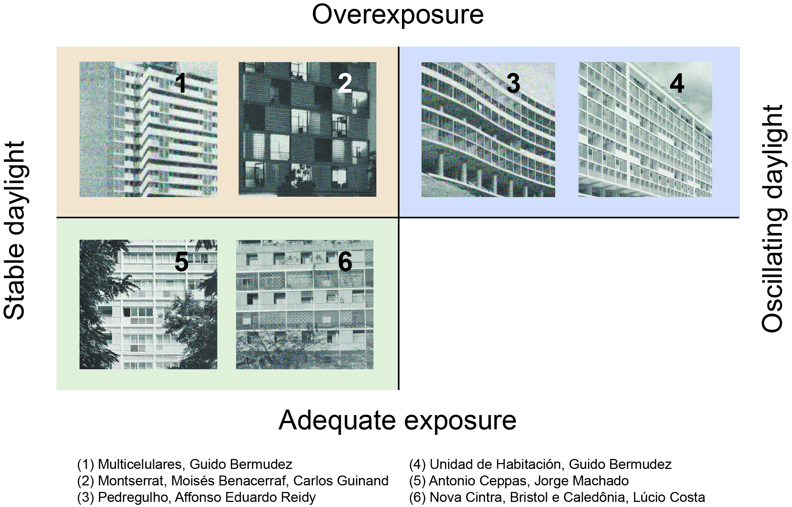
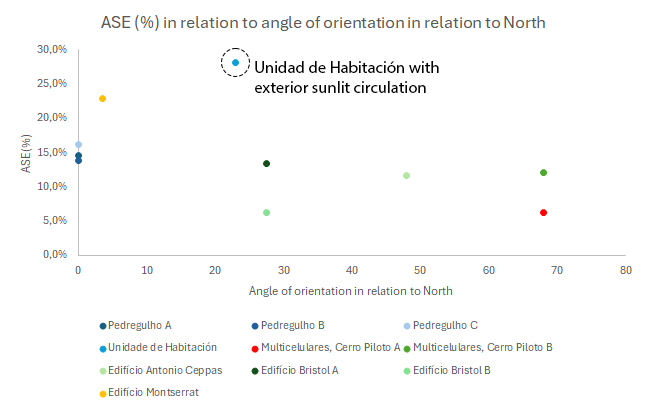
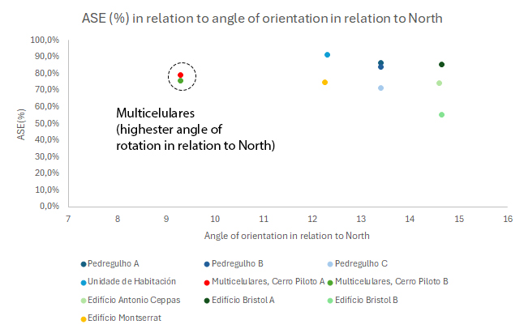

# ☀️ Daylight Analysis in South American Modern Housing (1950–1954)

Welcome to the official repository for the study **“Environmental adequacy in modern South American collective housing: comparative analysis of daylight in six projects (1950–1954)”** by João Navarrete de Almeida. The material was developed for Patrick Kastner's course on Data Driven Methods for Sustainable Architecture at GeorgiaTech. This repository contains all the data, simulation tools, and analysis scripts needed to **replicate or extend** the pilot daylighting study of six modernist housing projects in Rio de Janeiro and Caracas.

## 🏗️ Project Description

This project examines claims made by the 1955 MoMA exhibition *Latin American Architecture Since 1945*, which argued that regional modernism incorporated effective environmental controls. Using computational daylight simulations, this study evaluates **six tropical housing projects** to test those claims empirically.

---

## 🧪 Methodology

### 1. 📚 Literature Review
A preliminary review of 150 publications was conducted using the terms:

- `Latin American modern architecture` + `daylight`, `thermal`, `cooling`
- Sources were filtered by title relevance, abstract content, and full review readiness.

> See `data/jnavarrete_literaturereview_LAModern.xlsx` for full screening data.

### 2. 🏛️ Building Selection

From 48 projects in the 1955 MoMA catalog, 6 were selected based on:

- **Program**: collective housing
- **Climate**: Köppen Aw (tropical savanna)

| Project | Architect(s) | City | Year |
|--------|-------------|------|------|
| Pedregulho | Eduardo Affonso Reidy | Rio de Janeiro | 1950 |
| Unidade de Habitação | Guido Bermudez | Caracas | 1954 |
| Multicelulares | Bermudez & Villanueva | Caracas | 1954 |
| Antonio Ceppas | Jorge Machado Moreira | Rio de Janeiro | 1952 |
| Cintra, Bristol & Caledônia | Lúcio Costa | Rio de Janeiro | 1953 |
| Montserrat | Benacerraf & Guinand | Caracas | 1950 |

---

### 3. 🖥️ Simulation Procedure

All daylight simulations were performed using **Solemma’s ClimateStudio** with models created in **Rhinoceros 8** + **Grasshopper**. Scripts for facade devices are provided:

- `scripts/brisesoleil.gh`
- `scripts/brisesoleilhorizontal.gh`
- `scripts/musharabya.gh`

**Modeling assumptions:**

- Wall thickness: 18–25 cm
- Window height: 120 cm, sill at 105 cm
- No glazing thickness modeled
- Brise-soleil & musharabya treated via parametrized Grasshopper scripts
- All floorplates treated with open door policy
- Floor area excludes walls
- Floor albedo: 0,2

Materials used:
- Matte White Wall
- Wood Floor
- Clear-clear glazing
- Dupont Clay

---

## 📊 Results

Daylight performance was measured using:

- **Mean & median lux**
- **Annual Sunlight Exposure (ASE)**
- **Spatial Daylight Autonomy (sDA)**
- **Daylight Glare Probability (DGP)**

Key findings:

- Lúcio Costa’s and Jorge Machado’s projects (with well-proportioned brise-soleil and musharabya) perform best.
- Orientation (angle from North) plays a significant role in performance—even without shading devices.
- High ASE and variation = poor environmental adequacy (e.g., Reidy’s Pedregulho).

---

## 🛠️ Replication Guide

1. 🧾 **Download Files**
   - Clone this repo or download ZIP.
   - Get `scripts/`, and download models and performance reports in the link below:
   - https://1drv.ms/u/c/7f0cd2b9d40f94b7/EbbYP4i8NJRBk9iChpRlT3sBRrjMjIzf_Y7Ya1PhmRS5FQ?e=0eFAG1

2. 💻 **Install Tools**
   - Rhino 8 with Grasshopper
   - Solemma ClimateStudio

3. ⚙️ **Run Simulations**
   - Open `.3dm` files and attach appropriate Grasshopper scripts
   - Adjust orientation for each model using Rhino tools
   - Simulate for:
     - June 21 (Summer Solstice)
     - Sept 22 (Equinox)
     - Dec 21 (Winter Solstice)

4. 📈 **Analyze Results**
   - Use `data/daylightanalysis_LaModern.xlsx` for data organization
   - Data visualization is already set up in the spreadsheet.

---

## 📁 Repository Structure
.
├─ src/
│  ├─ 01_prompt_llm.py
│  ├─ 02_parse_mesh.py
│  └─ 03_mesh_to_ifc.py
├─ examples/
│  ├─ bim_object.ifc
│  ├─ obj_mess.txt
│  └─ parsed_mesh.txt
├─ requirements.txt
└─ README.md

   

